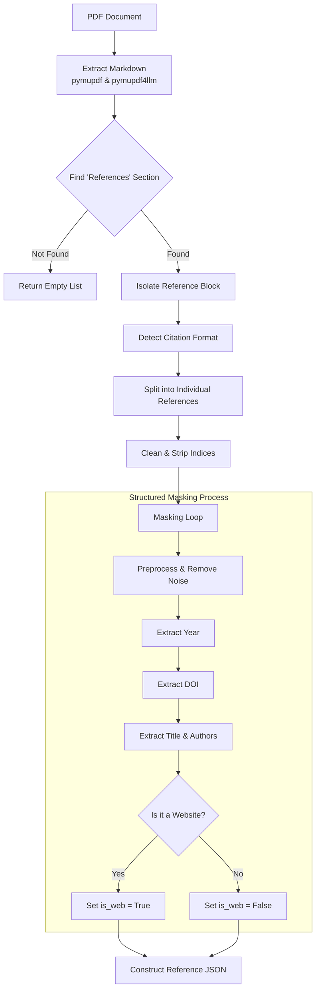
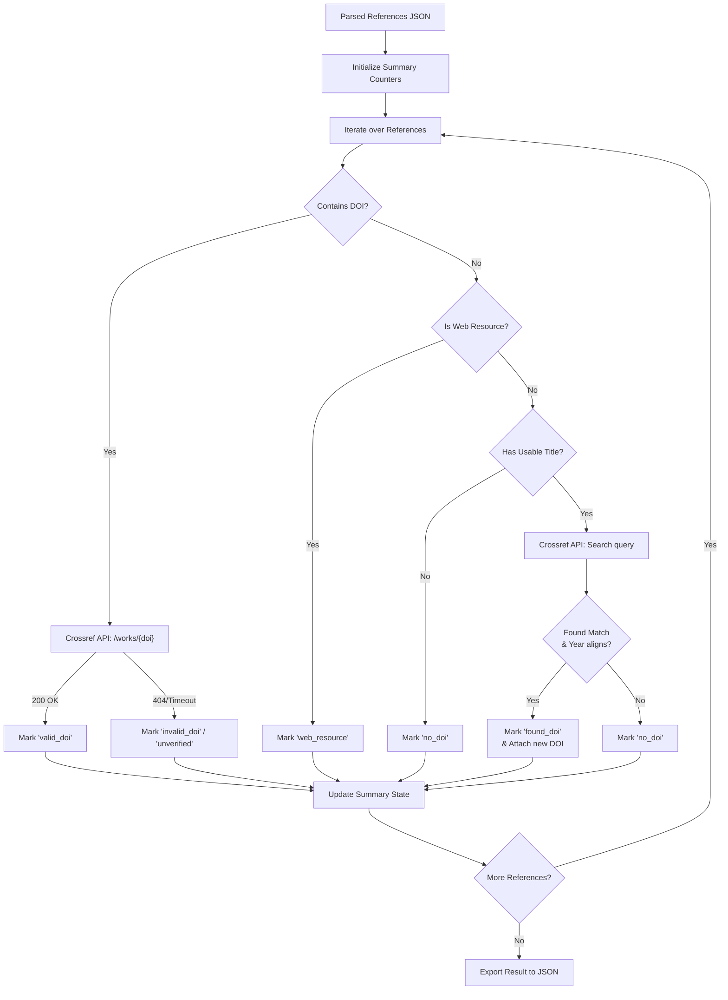

# DOI Checker — Reference Validation System

## 📖 Project Overview
The DOI Checker is an automated pipeline designed to extract, structure, and validate academic references from documents (PDF, DOCX, or scanned images). By transforming unstructured text into standardized JSON models and validating them against the Crossref API, it acts as a reliable reference analysis tool. The system intelligently detects citation formats (e.g., PLOS, IEEE, APA), removes noise like web junk, and significantly optimizes API limits by filtering out standalone web resources.

---

## 🏗️ System Architecture & Workflow

The system is split into two primary pipelines: **Reference Extraction** and **API Validation & Enrichment**.

### 1. Reference Extraction Pipeline (`preprocessing.py` & `masking.py`)
This phase focuses on parsing raw files and intelligently extracting citations.
- **Document Ingestion:** Converts PDF layouts into Markdown using `pymupdf4llm` and isolates the "References" section.
- **Format Detection:** Analyzes the isolated block to determine the citation style (numeric brackets, bold numbers, etc.).
- **Reference Segmentation:** Splits the text block into an array of individual reference strings, cleaning away numerical prefixes and bullets.
- **Masking & Data Extraction:** Each string undergoes an advanced Regular Expression (Regex) extraction loop to populate a structured data model:
  - **Noise Removal:** Cleans up access dates, trailing issue numbers, and extra URLs.
  - **Entity Extraction:** Strips and parses the Year, DOI, Authors, and Title. Smart logic prevents venue names (like *Proceedings of...*) from being misidentified as titles.
  - **Website Identification:** Assesses if the citation belongs to a whitelist of academic domains to flag arbitrary web resources.



### 2. API Validation & Enrichment Pipeline (`doi_validator.py` & `tasks.py`)
This pipeline acts as the enrichment engine, interacting with the external Crossref API to verify existing DOIs or discover missing ones.
- **Validation Router:**
  - **Direct DOI Check:** If a DOI was extracted, it fires a GET request to verify its existence, marking it as `"valid_doi"`, `"invalid_doi"`, or `"unverified"`.
  - **Web Resource Filter:** If marked as a web resource and no DOI is present, it bypasses API checking to save quotas, marking it `"web_resource"`.
  - **Metadata Deep Search:** For academic citations missing a DOI, it builds a search query using the parsed title. If the Crossref response year aligns with the natively extracted year, it snatches the DOI and marks it `"found_doi"`.
- **Result Aggregation:** Safely aggregates all discoveries, updates the success metrics pool, and exports the fully enriched JSON model.

---

## 📂 Directory Structure

The project has recently been refactored for deeper modularity. Using a decoupled architecture improves the maintainability of complex regex operations and data structures.

```text
doi_checker/
├── frontend/                  # React Single-Page Application
│   ├── src/
│   │   ├── components/        # Reusable UI (UploadZone, ProgressBar, ResultCard, etc.)
│   │   ├── pages/             # Route endpoints (HomePage, ResultPage)
│   │   ├── hooks/             # Custom state management (useUpload, useJob)
│   │   └── utils/             # Axios API clients
│   └── package.json
│
└── backend/                   # Python FastAPI Backend
    ├── core/                  # Extraction and processing logic
    │   ├── preprocessing.py   # PDF I/O, format detection, global block extraction
    │   ├── masking.py         # The masking core: Regex extraction, field parsing, text cleanup
    │   └── doi_validator.py   # Crossref REST API validation and fallback deep-searching
    ├── api/                   # Web routes and schemas
    │   └── routes.py          # Endpoints: /upload, /status/{job_id}, /result/{job_id}
    ├── temporary/             # Sandbox directory for uploaded file processing
    ├── result/                # JSON output directory for extracted datasets
    └── tasks.py               # Main pipeline orchestration / Celery worker substitute
```

---

## 🚀 Getting Started

Designed to run completely locally, including asynchronous queue setups.

### Prerequisites
- NodeJS (18+)
- Python (3.11+)
- Docker (optional, but recommended for running Redis/Celery environments)


---

## 📊 Project Status & Roadmap

**Current Progress:**
- [x] Refactor core pipeline to separate `preprocessing.py` and `masking.py`.
- [x] Integrate Crossref API validation and smart DOI deduction workflows.
- [x] Resolve major title extraction bugs (preventing venue names and URLs acting as titles).
- [x] Handle missing year edge-cases & PLOS author demarcations.
- [x] Introduce smart web-resource filtering to stop unnecessary Crossref calls.

**To-Do / Upcoming Roadmap:**
- [ ] **Dockerization:** Fully package the FastAPI backend and frontend into deployable Docker containers.
- [ ] **OCR Upgrade:** Better support for natively scanned image-based PDFs utilizing Tesseract / LayoutLM.
- [ ] **Batch Processing:** Introduce bulk document uploads and asynchronous zip-file deliveries in the frontend component.
- [ ] **DB Integration:** Swap standard disk I/O JSON output for SQLite / MongoDB integration for historical tracking.
