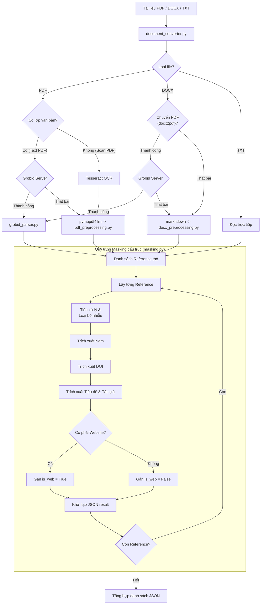

# DOI Checker — Hệ thống Xác thực Tài liệu Tham khảo

## 🚀 Hướng dẫn khởi chạy nhanh

Hệ thống đã được tích hợp Full-stack. Bạn chỉ cần chạy backend là toàn bộ ứng dụng (bao gồm giao diện web) sẽ sẵn sàng.

### 1. Yêu cầu hệ thống (Prerequisites)

- **Python**: Phiên bản 3.8 trở lên.
- **Docker**: Để chạy máy chủ Grobid (xử lý PDF).
- **Tesseract OCR**: Cần thiết nếu bạn muốn xử lý các file PDF dạng ảnh quét (Scan).

### 2. Cài đặt Grobid (Docker)

Grobid là "trái tim" của việc bóc tách PDF. Hãy cài đặt và chạy nó bằng Docker:

```bash
# 1. Tải image Grobid từ Docker Hub
docker pull lfoppiano/grobid:0.9.0

# 2. Chạy container Grobid (port 8070)
docker run -t --rm -p 8070:8070 lfoppiano/grobid:0.9.0
```

*Hệ thống sẽ tự động kiểm tra trạng thái Grobid tại `http://localhost:8070` khi khởi chạy.*

### 3. Cài đặt thư viện Python

```bash
cd backend
# Cài đặt các thư viện cần thiết
pip install -r requirements.txt
```

### 4. Khởi chạy Server

```bash
python main.py
```

*Truy cập: Mở trình duyệt và vào `http://localhost:8000`*

---

## 📖 Tổng quan dự án

**DOI Checker** là một luồng xử lý (pipeline) tự động được thiết kế để trích xuất, cấu trúc hóa và xác thực các tài liệu tham khảo học thuật từ các tệp tài liệu **(PDF, DOCX hoặc TXT)**. Bằng cách chuyển đổi văn bản thô thành các mô hình dữ liệu JSON chuẩn và đối soát với **Crossref API**, hệ thống đóng vai trò như một công cụ phân tích trích dẫn tin cậy. Hệ thống có khả năng nhận diện thông minh các định dạng trích dẫn (như PLOS, IEEE, APA, Author-Year), loại bỏ "rác" văn bản và tối ưu hóa giới hạn gọi API bằng cách lọc bỏ các tài nguyên web không cần thiết.

> **Lưu ý về định dạng `.doc`:** File `.doc` (Word cũ) không được hỗ trợ xử lý. Vui lòng chuyển sang `.docx` hoặc `.pdf` trước khi tải lên.

---

## 📋 Các định dạng trích dẫn được hỗ trợ

Hệ thống sử dụng thuật toán nhận diện thông minh để phân loại định dạng trích dẫn (Citation Style) ngay khi bắt đầu xử lý. Việc trình bày đúng định dạng giúp hệ thống trích xuất chính xác hơn:

### 1. Định dạng PLOS (Đánh số kiểu 1.)

Phổ biến trong các tạp chí Y sinh.

- **Dấu hiệu nhận diện:** Dòng bắt đầu bằng số và dấu chấm (`1. `, `2. `).
- **Mẫu chuẩn:**
  > 1. Smith J, Doe A. Title of the paper. PLOS ONE. 2024. https://doi.org/10.1371/journal.pone.0123456
  > 2. Nguyen B, et al. Research on AI. Nature. 2023.
  >

### 2. Định dạng IEEE (Đánh số trong ngoặc vuông [1])

Sử dụng rộng rãi trong kỹ thuật, CNTT (IEEE, ACM).

- **Dấu hiệu nhận diện:** Dòng bắt đầu bằng số trong ngoặc vuông (`[1]`, `[2]`).
- **Mẫu chuẩn:**
  > [1] J. Smith and A. Doe, "Title of the paper," IEEE Transactions on AI, vol. 5, 2024. doi: 10.1109/TAI.2024.1234567
  >

### 3. Định dạng APA / Author-Year (Tác giả (Năm))

Định dạng phổ biến nhất trong khoa học cơ bản và xã hội.

- **Dấu hiệu nhận diện:** Dòng bắt đầu bằng tên tác giả, theo sau là năm trong ngoặc đơn `(2024)`.
- **Mẫu chuẩn:**
  > Smith, J., & Doe, A. (2024). Title of the paper. Journal Name, 12(3), 45-60. https://doi.org/10.1016/j.jar.2024.01.001
  > Nguyen, B. (2023). Advances in Machine Learning. AI Review.
  >

### 4. Định dạng Dấu gạch đầu dòng (Dash Style)

- **Dấu hiệu nhận diện:** Dòng bắt đầu bằng dấu gạch ngang `-` và một chữ cái viết hoa.
- **Mẫu chuẩn:**
  > - Smith J, Doe A. Title of the paper. 2024.
  >
  > - Nguyen B. AI Research. 2023.
  >

### 5. Định dạng Inline (Phân cách bằng dấu gạch ngang)

Dành cho trường hợp các tài liệu tham khảo viết liền nhau trên cùng một khối văn bản.

- **Mẫu chuẩn:**
  > Smith J. Title 1. 2024. - Doe A. Title 2. 2023.
  >

---

## 🏗️ Kiến trúc Hệ thống & Luồng công việc

Hệ thống được chia thành hai luồng xử lý chính: **Trích xuất Tài liệu tham khảo** và **Xác thực & Làm giàu dữ liệu qua API**.

### 1. Chuyển đổi Tài liệu (`document_converter.py`)

Trước khi xử lý, mọi tài liệu đều được chuẩn hóa sang định dạng Markdown trung gian:

| Định dạng | Thư viện sử dụng          | Ghi chú                                                  |
| ------------ | ----------------------------- | --------------------------------------------------------- |
| `.pdf` (Text) | `Grobid` (Chính) / `pymupdf4llm` (Phụ) | Trích xuất metadata và text trực tiếp từ lớp văn bản |
| `.pdf` (Scan) | `pdf2image` + `pytesseract` | Chuyển đổi trang sang ảnh và dùng OCR để lấy nội dung |
| `.docx`    | `docx2pdf` + Grobid (Chính) / `markitdown` (Dự phòng) | Ưu tiên chuyển PDF để xử lý qua Grobid; fallback sang Markdown nếu lỗi |
| `.txt`     | Built-in `open()`           | Đọc trực tiếp với encoding UTF-8                     |
| `.doc`     | —                            | Không hỗ trợ, trả lỗi ngay                           |

### 2. Luồng Trích xuất Tài liệu tham khảo

Giai đoạn này tập trung vào việc phân tích Markdown và trích xuất trích dẫn một cách thông minh, được chia thành **hai module riêng biệt** tùy theo loại tài liệu:

#### 2a. PDF Processing

Hệ thống tự động phân loại PDF để áp dụng luồng xử lý tối ưu:

- **Luồng PDF Văn bản (Text-based PDF):**
  - **Primary Engine (Grobid):** Gửi trực tiếp file tới máy chủ Grobid. Đây là luồng ưu tiên vì Grobid có khả năng nhận diện cấu trúc học thuật (tác giả, tiêu đề, journal) cực kỳ chính xác.
  - **Fallback Mechanism:** Nếu Grobid lỗi hoặc không tìm thấy reference, hệ thống dùng `pymupdf4llm` để lấy text dạng Markdown và đẩy qua bộ lọc `pdf_preprocessing.py`.

- **Luồng PDF Hình ảnh (Scanned/Image PDF):**
  - **OCR Engine:** Sử dụng `pytesseract` kết hợp với `pdf2image`.
  - **Quy trình:** Chuyển đổi từng trang PDF thành ảnh chất lượng cao -> Chạy OCR đa luồng (`ProcessPoolExecutor`) -> Tổng hợp thành Markdown -> Xử lý qua pipeline Masking truyền thống.

#### 2b. DOCX Processing (Dual-Pipeline)

Luồng xử lý DOCX được thiết kế theo mô hình "Ưu tiên độ chính xác, đảm bảo độ ổn định":

- **Primary Pipeline (Grobid via PDF):** Sử dụng `docx2pdf` (Windows) hoặc `LibreOffice` (Linux) để chuyển đổi tài liệu sang PDF trung gian, sau đó gửi tới máy chủ **Grobid**. Cách này cho phép bóc tách metadata (tác giả, tiêu đề, journal) với độ chính xác cực cao từ các tệp Word phức tạp.
- **Fallback Mechanism (MarkItDown + `docx_preprocessing.py`):** Nếu việc chuyển đổi sang PDF thất bại (ví dụ: hệ thống không cài Microsoft Word) hoặc Grobid gặp sự cố, hệ thống tự động kích hoạt luồng dự phòng:
  - **MarkItDown:** Chuyển đổi DOCX sang Markdown.
  - **Line Healing (Tái hợp dòng thông minh):** Thuật toán nhận biết ranh giới reference theo từng định dạng (`plos`, `ieee`, `author_year`), tự động nối các dòng bị ngắt vào đúng reference.
  - **Cắt phụ lục tự động:** Phát hiện và cắt bỏ các section thừa sau danh sách tham khảo.

#### 2c. Vòng lặp Masking & Trích xuất dữ liệu (`masking.py`)

Mỗi chuỗi trích dẫn sẽ đi qua pipeline Regex nâng cao để đổ dữ liệu vào mô hình `Reference`:

| Bước                                        | Mô tả                                                                                                                             |
| --------------------------------------------- | ----------------------------------------------------------------------------------------------------------------------------------- |
| **Tiền xử lý**                       | Sửa URL bị vỡ dấu `_._`, ký tự `~`, khoảng trắng trong `://`, loại bỏ ngày truy cập (PLOS)                        |
| **Trích xuất Năm**                   | Ưu tiên dạng `(2024)`, fallback sang năm đứng độc lập                                                                    |
| **Trích xuất DOI**                    | Nhận diện `doi.org/...` và `doi:...`, chuẩn hóa khoảng trắng, tách `PMID/PMCID`                                       |
| **Trích xuất Tiêu đề & Tác giả** | 4 nhánh logic: tiêu đề trong ngoặc kép → tách theo `[YEAR]` → PLOS pattern → fallback ranh giới tên                   |
| **Làm sạch Tiêu đề**               | Cắt trước tên tạp chí/hội nghị (VENUE_PATTERN), xóa URL và domain trần dính vào cuối                                  |
| **Phân loại Web**                     | Kiểm tra URL trong trích dẫn với danh sách 40+ tên miền học thuật; gắn `is_web=True` nếu là trang web thông thường |

**Danh sách học thuật domains được nhận diện:** `doi.org`, `arxiv.org`, `biorxiv.org`, `nature.com`, `springer.com`, `sciencedirect.com`, `ieee.org`, `acm.org`, `pubmed.ncbi.nlm.nih.gov`, `plos.org`, `jstor.org`, `researchgate.net`, và 30+ domain khác.



### 3. Luồng Xác thực & Làm giàu dữ liệu API (`doi_validator.py` & `tasks.py`)

Đóng vai trò là công cụ "làm giàu" thông tin, tương tác với Crossref API để xác minh DOI hiện có hoặc tìm kiếm các DOI còn thiếu.

#### Bộ điều hướng xác thực (Validation Router):

| Trường hợp                                                                      | Hành động                   | Trạng thái kết quả     |
| ---------------------------------------------------------------------------------- | ------------------------------ | -------------------------- |
| Đã có DOI → Crossref trả 200                                                  | Xác nhận hợp lệ            | `valid_doi`              |
| Đã có DOI → Crossref trả 404                                                  | Đánh dấu không hợp lệ    | `invalid_doi`            |
| Đã có DOI → Timeout/lỗi mạng                                                 | Không xác định được     | `unverified`             |
| Là web resource( không phải các trang học thuật ), không có DOI       | Bỏ qua API, tiết kiệm quota | `web_resource`           |
| Không có tiêu đề lẫn tác giả                                               | Bỏ qua, không tìm kiếm     | `web_resource`           |
| Có tiêu đề → Search Crossref →**Khớp tiêu đề ≥ 85% & khớp năm** | Gán DOI tìm được          | `found_doi`              |
| Có tiêu đề → Không khớp / Không tìm thấy                                 | Không có DOI                 | `no_doi`                 |
| Không có tiêu đề nhưng có raw text → Search theo bibliographic             | Tìm kiếm fallback            | `found_doi` / `no_doi` |

> **Fuzzy Matching:** Khi tìm DOI qua tiêu đề, hệ thống dùng `difflib.SequenceMatcher` để so sánh tiêu đề trích xuất với kết quả Crossref. Chỉ chấp nhận kết quả có **độ tương đồng ≥ 85%**, tránh trả về DOI sai.

#### Tổng hợp kết quả:

Mỗi reference sau xác thực được bổ sung thêm `doi_status` và `index`. Kết quả cuối cùng bao gồm:

- `job_id`, `filename`, `status`
- `summary`: thống kê `total_refs`, `original_has_doi`, `valid_doi`, `found_doi`, `invalid_doi`, `unverified`, `no_doi`, `web_resource`
- `references`: danh sách đầy đủ từng reference với metadata


### 4. Cơ chế Tích hợp Full-stack & API

Dự án sử dụng kiến trúc thống nhất, một server phục vụ cả backend lẫn frontend:

- **Unified Server (`main.py`)**: Vừa là API Server (FastAPI) vừa là Static File Server. Phục vụ `index.html` tại `/` và mount toàn bộ thư mục `frontend/src/public/` làm static assets.
- **CORS Middleware**: Cho phép mọi origin (`*`), hỗ trợ phát triển local và tích hợp với bất kỳ frontend nào.
- **Session Isolation (Cơ chế cô lập)**: Mỗi lượt upload được cấp một `session_id` (UUID) duy nhất. Toàn bộ file tạm và file kết quả được lưu vào thư mục con riêng biệt (`temporary/<id>/` và `result/<id>/`) để tránh xung đột dữ liệu khi nhiều người dùng thao tác cùng lúc.
- **Batch Processing Pipeline (`POST /api/process`)**:
  1. Nhận danh sách file upload, lưu vào `temporary/<session_id>/`.
  2. Gọi `pipeline(session_id)` để xử lý toàn bộ các file trong session đó.
  3. Đọc kết quả JSON từ `result/<session_id>/`, ánh xạ dữ liệu và trả về cho frontend.
  4. **Auto-Cleanup**: Tự động dọn dẹp sạch sẽ các thư mục session trong cả `temporary/` và `result/` sau khi hoàn tất.
- **Health Check Endpoint (`GET /api/test`)**: Endpoint kiểm tra trạng thái server, trả về `{"status": "ok"}`.

---

## 🖥️ Giao diện Frontend

Frontend được xây dựng bằng HTML/CSS/JS thuần, phục vụ trực tiếp từ FastAPI:

| Tính năng                          | Mô tả                                                                                                              |
| ------------------------------------ | -------------------------------------------------------------------------------------------------------------------- |
| **Particle Canvas Background** | Hiệu ứng nền hạt tương tác, vẽ bằng Canvas API                                                              |
| **Drag & Drop Upload**         | Kéo thả file hoặc click để chọn, hỗ trợ multi-file                                                           |
| **Bộ lọc định dạng**      | Chỉ chấp nhận `.pdf`, `.docx`, `.doc`, `.txt`; hiển thị toast lỗi nếu sai định dạng                |
| **Danh sách file**            | Hiển thị tên, kích thước, trạng thái từng file (Sẵn sàng / Đang xử lý / Hoàn thành / Lỗi)           |
| **Thanh tiến trình**         | Progress bar + phần trăm cập nhật theo từng file đang xử lý                                                  |
| **Thống kê tổng hợp**      | 4 chỉ số: Files đã xử lý, DOI tìm thấy, DOI hợp lệ, DOI không hợp lệ — có hiệu ứng đếm số mượt |
| **Thẻ kết quả DOI**         | Mỗi DOI là một thẻ có thể mở/đóng, hiển thị: DOI string, Tiêu đề, Tác giả, Tạp chí, Năm, Link DOI |
| **Xuất JSON**                 | Tải toàn bộ kết quả về máy dưới dạng file `.json`                                                        |
| **Toast Notification**         | Thông báo thành công/lỗi xuất hiện góc màn hình, tự động biến mất                                     |

---

## 📂 Cấu trúc Thư mục

```text
doi_checker/
├── frontend/                   # Mã nguồn giao diện (HTML/CSS/JS)
│   ├── .env                    # Cấu hình môi trường frontend
│   ├── package.json
│   └── src/
│       ├── public/             # Assets tĩnh (CSS/JS/Images)
│       │   ├── css/
│       │   │   └── style.css
│       │   ├── js/
│       │   │   └── script.js   # Logic upload, render kết quả, particle canvas
│       │   └── images/
│       └── views/
│           └── index.html      # Trang chính duy nhất (SPA-style)
│
└── backend/                    # Backend Python FastAPI (Unified Server)
    ├── main.py                 # Điểm khởi chạy chính (Entry point), CORS, Static mount
    ├── tasks.py                # Phối hợp Pipeline xử lý toàn bộ thư mục temporary/
    ├── api/
    │   └── route.py            # POST /api/process, GET /api/test
    ├── core/                   # Logic lõi
    │   ├── document_converter.py  # Chuyển đổi PDF/DOCX/TXT → Markdown
    │   ├── grobid_parser.py       # Tích hợp Grobid API để trích xuất metadata PDF
    │   ├── pdf_preprocessing.py   # Tách & làm sạch reference từ PDF (Luồng fallback)
    │   ├── docx_preprocessing.py  # Tách & làm sạch reference từ DOCX (line healing)
    │   ├── masking.py             # Regex Masking, trích xuất Author/Year/DOI/Title
    │   └── doi_validator.py       # Xác thực & tìm kiếm DOI qua Crossref API
    ├── temporary/              # Thư mục cha chứa các session upload tạm thời
    │   └── <session_id>/       # File gốc của từng phiên làm việc
    ├── result/                 # Thư mục cha chứa kết quả JSON
    │   └── <session_id>/       # Kết quả JSON riêng biệt theo từng phiên
    ├── scratch/                # Scripts thử nghiệm, file tạm trong quá trình dev
    └── testing/                # Tài liệu và script kiểm thử
```

---

## 📊 Trạng thái Dự án & Lộ trình (Roadmap)

**Đã hoàn thành:**

- [X] **Đa định dạng & Trích xuất thông minh:**
  - Hỗ trợ toàn diện **PDF (Text/Scan)**, **DOCX**, **TXT**.
  - Tích hợp **Grobid** (Xử lý PDF chuyên sâu) và **Tesseract OCR** (Xử lý PDF dạng ảnh).
  - Sử dụng **MarkItDown** kết hợp thuật toán **Line Healing** (Tái hợp dòng thông minh) giúp xử lý triệt để lỗi ngắt dòng trên mọi định dạng.
- [X] **Xác thực DOI & Thuật toán lõi:**
  - Tích hợp **Crossref API** với cơ chế **Fuzzy Matching** (so khớp tiêu đề ≥ 85%).
  - Luồng suy luận DOI thông minh: Tự động tìm kiếm theo tiêu đề hoặc Raw text nếu thiếu metadata.
  - Bộ lọc tài nguyên web thông minh (nhận diện 40+ academic domains) để tối ưu hạn ngạch API.
- [X] **Kiến trúc Hệ thống & Hiệu suất:**
  - Mô hình **Unified Server** (FastAPI phục vụ cả API và Frontend tĩnh).
  - **Session Isolation:** Cô lập dữ liệu người dùng bằng UUID và cơ chế **Auto-Cleanup** tự động dọn dẹp bộ nhớ tạm.
  - **Batch Processing:** Tối ưu hóa xử lý hàng loạt nhiều file cùng lúc bằng đa luồng (Threading) và đa tiến trình (Multiprocessing).
- [X] **Giao diện & Tiện ích:**
  - Frontend SPA hoàn chỉnh: Kéo thả file, thanh tiến trình, hiển thị kết quả dạng thẻ (Accordion), xuất dữ liệu JSON.
  - Hệ thống thông báo Toast và Endpoint kiểm tra trạng thái (**Health Check API**).

**Việc cần làm / Lộ trình sắp tới:**

- [ ] **Dockerization:** Đóng gói toàn bộ ứng dụng (Backend, Grobid, Tesseract) vào Docker Compose.
- [ ] **Tích hợp Database:** Lưu lịch sử xử lý vào SQLite / MongoDB.
- [ ] **Cải thiện UI/UX:** Thêm thanh tiến trình xử lý thời gian thực (WebSocket / SSE).
