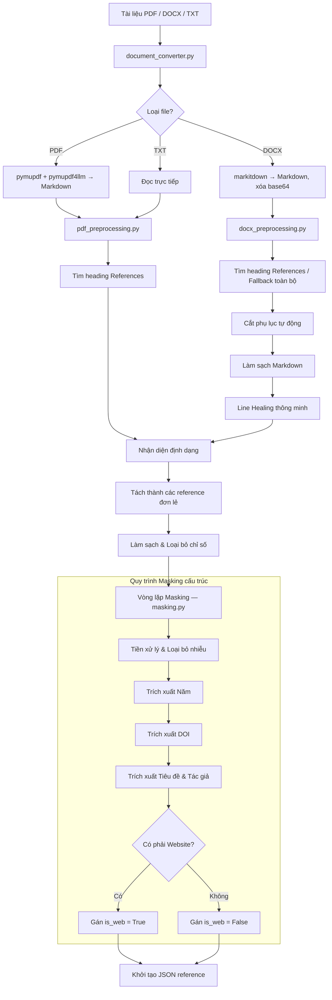
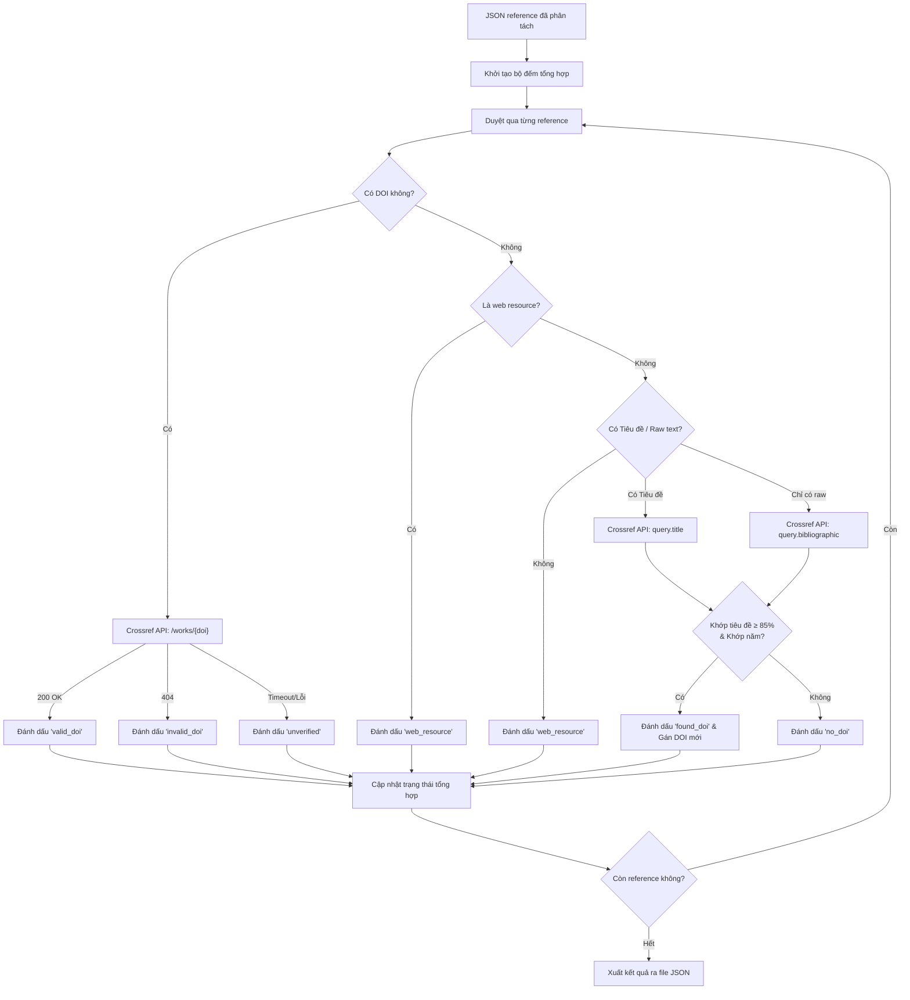

# DOI Checker — Hệ thống Xác thực Tài liệu Tham khảo

## 🚀 Hướng dẫn khởi chạy nhanh

Hệ thống đã được tích hợp Full-stack. Bạn chỉ cần chạy backend là toàn bộ ứng dụng (bao gồm giao diện web) sẽ sẵn sàng.

1. **Chuẩn bị môi trường**:
   ```bash
   cd backend
   # Cài đặt các thư viện cần thiết (FastAPI, uvicorn, pymupdf, pymupdf4llm, markitdown, requests, v.v.)
   pip install -r requirements.txt
   ```
2. **Khởi chạy Server**:
   ```bash
   python main.py
   ```
3. **Truy cập**: Mở trình duyệt và truy cập `http://localhost:8000`

---

## 📖 Tổng quan dự án

**DOI Checker** là một luồng xử lý (pipeline) tự động được thiết kế để trích xuất, cấu trúc hóa và xác thực các tài liệu tham khảo học thuật từ các tệp tài liệu **(PDF, DOCX hoặc TXT)**. Bằng cách chuyển đổi văn bản thô thành các mô hình dữ liệu JSON chuẩn và đối soát với **Crossref API**, hệ thống đóng vai trò như một công cụ phân tích trích dẫn tin cậy. Hệ thống có khả năng nhận diện thông minh các định dạng trích dẫn (như PLOS, IEEE, APA, Author-Year), loại bỏ "rác" văn bản và tối ưu hóa giới hạn gọi API bằng cách lọc bỏ các tài nguyên web không cần thiết.

> **Lưu ý về định dạng `.doc`:** File `.doc` (Word cũ) không được hỗ trợ xử lý. Vui lòng chuyển sang `.docx` hoặc `.pdf` trước khi tải lên.

---

## 🏗️ Kiến trúc Hệ thống & Luồng công việc

Hệ thống được chia thành hai luồng xử lý chính: **Trích xuất Tài liệu tham khảo** và **Xác thực & Làm giàu dữ liệu qua API**.

### 1. Chuyển đổi Tài liệu (`document_converter.py`)

Trước khi xử lý, mọi tài liệu đều được chuẩn hóa sang định dạng Markdown trung gian:

| Định dạng | Thư viện sử dụng | Ghi chú |
|-----------|-----------------|---------|
| `.pdf`    | `pymupdf` + `pymupdf4llm` | Chuyển đổi layout PDF sang Markdown |
| `.docx`   | `markitdown` | Chuyển đổi DOCX sang Markdown, xóa base64 ảnh nhúng |
| `.txt`    | Built-in `open()` | Đọc trực tiếp với encoding UTF-8 |
| `.doc`    | — | Không hỗ trợ, trả lỗi ngay |

### 2. Luồng Trích xuất Tài liệu tham khảo

Giai đoạn này tập trung vào việc phân tích Markdown và trích xuất trích dẫn một cách thông minh, được chia thành **hai module riêng biệt** tùy theo loại tài liệu:

#### 2a. PDF Preprocessing (`pdf_preprocessing.py`)
- **Tìm phần References:** Regex tìm heading `References` theo mọi biến thể định dạng (in đậm, in nghiêng, có dấu `#`).
- **Nhận diện định dạng (Format Detection):** Phân tích khối văn bản để xác định kiểu trích dẫn:
  - `plos` — Đánh số dạng `1.` hoặc `**1.**`
  - `ieee` — Đánh số dạng `[1]`
  - `dash_newline` — Mỗi ref bắt đầu bằng `- `
  - `apa_inline` — Các ref nằm trên một dòng, phân cách bằng ` - `
  - `author_year` — Fallback mặc định (APA/Author-Year)
- **Phân đoạn & Làm sạch:** Tách khối thành từng trích dẫn riêng, loại bỏ chỉ số đầu dòng, sửa lỗi URL bị ngắt dòng, loại bỏ số trang và ký tự rác cuối chuỗi.

#### 2b. DOCX Preprocessing (`docx_preprocessing.py`)
Phiên bản nâng cấp dành riêng cho DOCX, miễn nhiễm với lỗi "rớt trang" phổ biến trong văn bản Word:
- **Fallback nội dung toàn bộ:** Nếu không tìm thấy heading `References`, hệ thống tự động fallback lấy toàn bộ nội dung thay vì trả về rỗng.
- **Cắt phụ lục tự động:** Phát hiện và cắt bỏ các section sau danh sách tham khảo (Acknowledgements, Appendix, Figure/Table captions).
- **Làm sạch Markdown:** Loại bỏ định dạng bold/italic, xử lý link Markdown `[text](url)` thành text thuần, hợp nhất dòng bị nối dấu gạch ngang cuối dòng (`-\n`).
- **Line Healing (Tái hợp dòng thông minh):** Thuật toán nhận biết **ranh giới bắt đầu một reference mới** theo từng định dạng (`plos`, `ieee`, `dash_newline`, `author_year`), tự động nối các dòng bị ngắt vào đúng reference, bao gồm:
  - Tự động nối dòng bắt đầu bằng URL/DOI vào reference trước.
  - Phát hiện reference mới bằng pattern `Tên Tác giả (Năm)` ngay cả khi không có dòng trắng phân cách.
  - Không tách dòng nếu dòng trước kết thúc bằng `,`, `and`, `&`, `-`, `–`, `et al.`.

#### 2c. Vòng lặp Masking & Trích xuất dữ liệu (`masking.py`)
Mỗi chuỗi trích dẫn sẽ đi qua pipeline Regex nâng cao để đổ dữ liệu vào mô hình `Reference`:

| Bước | Mô tả |
|------|-------|
| **Tiền xử lý** | Sửa URL bị vỡ dấu `_._`, ký tự `~`, khoảng trắng trong `://`, loại bỏ ngày truy cập (PLOS) |
| **Trích xuất Năm** | Ưu tiên dạng `(2024)`, fallback sang năm đứng độc lập |
| **Trích xuất DOI** | Nhận diện `doi.org/...` và `doi:...`, chuẩn hóa khoảng trắng, tách `PMID/PMCID` |
| **Trích xuất Tiêu đề & Tác giả** | 4 nhánh logic: tiêu đề trong ngoặc kép → tách theo `[YEAR]` → PLOS pattern → fallback ranh giới tên |
| **Làm sạch Tiêu đề** | Cắt trước tên tạp chí/hội nghị (VENUE_PATTERN), xóa URL và domain trần dính vào cuối |
| **Phân loại Web** | Kiểm tra URL trong trích dẫn với danh sách 40+ tên miền học thuật; gắn `is_web=True` nếu là trang web thông thường |

**Danh sách học thuật domains được nhận diện:** `doi.org`, `arxiv.org`, `biorxiv.org`, `nature.com`, `springer.com`, `sciencedirect.com`, `ieee.org`, `acm.org`, `pubmed.ncbi.nlm.nih.gov`, `plos.org`, `jstor.org`, `researchgate.net`, và 30+ domain khác.



### 3. Luồng Xác thực & Làm giàu dữ liệu API (`doi_validator.py` & `tasks.py`)

Đóng vai trò là công cụ "làm giàu" thông tin, tương tác với Crossref API để xác minh DOI hiện có hoặc tìm kiếm các DOI còn thiếu.

#### Bộ điều hướng xác thực (Validation Router):

| Trường hợp | Hành động | Trạng thái kết quả |
|------------|-----------|-------------------|
| Đã có DOI → Crossref trả 200 | Xác nhận hợp lệ | `valid_doi` |
| Đã có DOI → Crossref trả 404 | Đánh dấu không hợp lệ | `invalid_doi` |
| Đã có DOI → Timeout/lỗi mạng | Không xác định được | `unverified` |
| Là web resource, không có DOI | Bỏ qua API, tiết kiệm quota | `web_resource` |
| Không có tiêu đề lẫn tác giả | Bỏ qua, không tìm kiếm | `web_resource` |
| Có tiêu đề → Search Crossref → **Khớp tiêu đề ≥ 85% & khớp năm** | Gán DOI tìm được | `found_doi` |
| Có tiêu đề → Không khớp / Không tìm thấy | Không có DOI | `no_doi` |
| Không có tiêu đề nhưng có raw text → Search theo bibliographic | Tìm kiếm fallback | `found_doi` / `no_doi` |

> **Fuzzy Matching:** Khi tìm DOI qua tiêu đề, hệ thống dùng `difflib.SequenceMatcher` để so sánh tiêu đề trích xuất với kết quả Crossref. Chỉ chấp nhận kết quả có **độ tương đồng ≥ 85%**, tránh trả về DOI sai.

#### Tổng hợp kết quả:
Mỗi reference sau xác thực được bổ sung thêm `doi_status` và `index`. Kết quả cuối cùng bao gồm:
- `job_id`, `filename`, `status`
- `summary`: thống kê `total_refs`, `original_has_doi`, `valid_doi`, `found_doi`, `invalid_doi`, `unverified`, `no_doi`, `web_resource`
- `references`: danh sách đầy đủ từng reference với metadata



### 4. Cơ chế Tích hợp Full-stack & API

Dự án sử dụng kiến trúc thống nhất, một server phục vụ cả backend lẫn frontend:

- **Unified Server (`main.py`)**: Vừa là API Server (FastAPI) vừa là Static File Server. Phục vụ `index.html` tại `/` và mount toàn bộ thư mục `frontend/src/public/` làm static assets.
- **CORS Middleware**: Cho phép mọi origin (`*`), hỗ trợ phát triển local và tích hợp với bất kỳ frontend nào.
- **Batch Processing Pipeline (`POST /api/process`)**:
  1. Nhận danh sách file upload, lưu tất cả vào `temporary/`.
  2. Gọi `pipeline()` **một lần duy nhất** để xử lý toàn bộ.
  3. Đọc kết quả JSON từ `result/` và trả về cùng lúc cho frontend.
- **Health Check Endpoint (`GET /api/test`)**: Endpoint kiểm tra trạng thái server, trả về `{"status": "ok"}`.

---

## 🖥️ Giao diện Frontend

Frontend được xây dựng bằng HTML/CSS/JS thuần, phục vụ trực tiếp từ FastAPI:

| Tính năng | Mô tả |
|-----------|-------|
| **Particle Canvas Background** | Hiệu ứng nền hạt tương tác, vẽ bằng Canvas API |
| **Drag & Drop Upload** | Kéo thả file hoặc click để chọn, hỗ trợ multi-file |
| **Bộ lọc định dạng** | Chỉ chấp nhận `.pdf`, `.docx`, `.doc`, `.txt`; hiển thị toast lỗi nếu sai định dạng |
| **Danh sách file** | Hiển thị tên, kích thước, trạng thái từng file (Sẵn sàng / Đang xử lý / Hoàn thành / Lỗi) |
| **Thanh tiến trình** | Progress bar + phần trăm cập nhật theo từng file đang xử lý |
| **Thống kê tổng hợp** | 4 chỉ số: Files đã xử lý, DOI tìm thấy, DOI hợp lệ, DOI không hợp lệ — có hiệu ứng đếm số mượt |
| **Thẻ kết quả DOI** | Mỗi DOI là một thẻ có thể mở/đóng, hiển thị: DOI string, Tiêu đề, Tác giả, Tạp chí, Năm, Link DOI |
| **Xuất JSON** | Tải toàn bộ kết quả về máy dưới dạng file `.json` |
| **Toast Notification** | Thông báo thành công/lỗi xuất hiện góc màn hình, tự động biến mất |

---

## 📂 Cấu trúc Thư mục

```text
doi_checker/
├── frontend/                   # Mã nguồn giao diện (HTML/CSS/JS)
│   ├── .env                    # Cấu hình môi trường frontend
│   ├── package.json
│   └── src/
│       ├── public/             # Assets tĩnh (CSS/JS/Images)
│       │   ├── css/
│       │   │   └── style.css
│       │   ├── js/
│       │   │   └── script.js   # Logic upload, render kết quả, particle canvas
│       │   └── images/
│       └── views/
│           └── index.html      # Trang chính duy nhất (SPA-style)
│
└── backend/                    # Backend Python FastAPI (Unified Server)
    ├── main.py                 # Điểm khởi chạy chính (Entry point), CORS, Static mount
    ├── tasks.py                # Phối hợp Pipeline xử lý toàn bộ thư mục temporary/
    ├── api/
    │   └── route.py            # POST /api/process, GET /api/test
    ├── core/                   # Logic lõi
    │   ├── document_converter.py  # Chuyển đổi PDF/DOCX/TXT → Markdown
    │   ├── pdf_preprocessing.py   # Tách & làm sạch reference từ PDF Markdown
    │   ├── docx_preprocessing.py  # Tách & làm sạch reference từ DOCX (line healing)
    │   ├── masking.py             # Regex Masking, trích xuất Author/Year/DOI/Title
    │   └── doi_validator.py       # Xác thực & tìm kiếm DOI qua Crossref API
    ├── temporary/              # Nơi lưu file vừa upload (tạm thời)
    ├── result/                 # Nơi chứa kết quả JSON sau khi xử lý
    ├── scratch/                # Scripts thử nghiệm, file tạm trong quá trình dev
    └── testing/                # Tài liệu và script kiểm thử
```

---

## 📊 Trạng thái Dự án & Lộ trình (Roadmap)

**Đã hoàn thành:**
- [x] Tái cấu trúc pipeline cốt lõi, tách biệt `pdf_preprocessing.py` và `docx_preprocessing.py`.
- [x] Hỗ trợ thêm định dạng **TXT** trong `document_converter.py`.
- [x] Sử dụng **MarkItDown** để chuyển đổi DOCX sang Markdown chuẩn hóa.
- [x] Tích hợp xác thực API Crossref và luồng suy luận DOI thông minh.
- [x] **Fuzzy Matching:** Tìm DOI bằng so khớp tiêu đề với độ tương đồng ≥ 85% (`SequenceMatcher`).
- [x] **Fallback tìm kiếm theo raw text** khi không có tiêu đề trích xuất được.
- [x] **Line Healing (DOCX):** Tái hợp dòng thông minh, nhận diện ranh giới reference chính xác.
- [x] Khắc phục các lỗi lớn về trích xuất tiêu đề (venue pattern, URL dính vào title).
- [x] Xử lý các trường hợp thiếu năm và cách phân tách tác giả trên PLOS.
- [x] Triển khai bộ lọc tài nguyên web thông minh (40+ academic domains).
- [x] **Kết nối Full-stack:** Đồng bộ Frontend và FastAPI server (Unified Server).
- [x] **Xử lý hàng loạt (Batch Processing):** Tối ưu hóa việc gọi pipeline khi upload nhiều file cùng lúc.
- [x] **Frontend hoàn chỉnh:** Drag & Drop, progress bar, thẻ DOI có thể mở/đóng, xuất JSON, toast notification.
- [x] **Health Check Endpoint:** `GET /api/test` kiểm tra trạng thái server.

**Việc cần làm / Lộ trình sắp tới:**
- [ ] **Dockerization:** Đóng gói ứng dụng vào Docker containers.
- [ ] **Nâng cấp OCR:** Hỗ trợ tốt hơn cho PDF dạng ảnh quét bằng Tesseract / LayoutLM.
- [ ] **Tích hợp Database:** Lưu lịch sử xử lý vào SQLite / MongoDB.
- [ ] **Cải thiện UI/UX:** Thêm thanh tiến trình xử lý thời gian thực (WebSocket / SSE).
- [ ] **Xóa file tạm tự động:** Uncomment phần `doc_file.unlink()` trong `tasks.py` khi deploy sản xuất.
