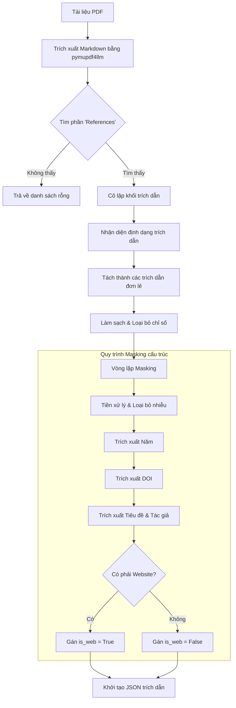
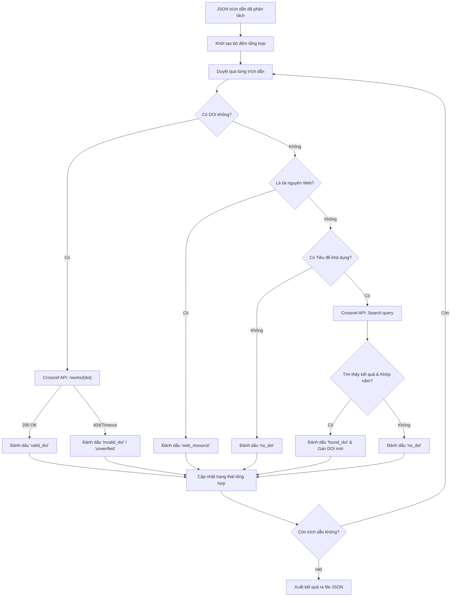

# DOI Checker — Hệ thống Xác thực Tài liệu Tham khảo

## 🚀 Hướng dẫn khởi chạy nhanh

Hệ thống đã được tích hợp Full-stack. Bạn chỉ cần chạy backend là toàn bộ ứng dụng (bao gồm giao diện web) sẽ sẵn sàng.

1. **Chuẩn bị môi trường**:
   ```bash
   cd backend
   # Cài đặt các thư viện cần thiết (FastAPI, uvicorn, pymupdf4llm, mammoth, requests, v.v.)
   pip install -r requirements.txt 
   ```
2. **Khởi chạy Server**:
   ```bash
   python main.py
   ```
3. **Truy cập**: Mở trình duyệt và truy cập `http://localhost:8000`

---

## 📖 Tổng quan dự án
**DOI Checker** là một luồng xử lý (pipeline) tự động được thiết kế để trích xuất, cấu trúc hóa và xác thực các tài liệu tham khảo học thuật từ các tệp tài liệu (PDF, DOCX hoặc ảnh quét). Bằng cách chuyển đổi văn bản thô thành các mô hình dữ liệu JSON chuẩn và đối soát với **Crossref API**, hệ thống đóng vai trò như một công cụ phân tích trích dẫn tin cậy. Hệ thống có khả năng nhận diện thông minh các định dạng trích dẫn (như PLOS, IEEE, APA), loại bỏ "rác" văn bản và tối ưu hóa giới hạn gọi API bằng cách lọc bỏ các tài nguyên web không cần thiết.

---

## 🏗️ Kiến trúc Hệ thống & Luồng công việc

Hệ thống được chia thành hai luồng xử lý chính: **Trích xuất Tài liệu tham khảo** và **Xác thực & Làm giàu dữ liệu qua API**.

### 1. Luồng Trích xuất Tài liệu tham khảo (`preprocessing.py` & `masking.py`)
Giai đoạn này tập trung vào việc phân tích tệp thô và trích xuất trích dẫn một cách thông minh.
- **Nạp tài liệu (Document Ingestion):** Chuyển đổi layout PDF sang định dạng Markdown bằng `pymupdf4llm` và cô lập phần "References".
- **Nhận diện định dạng (Format Detection):** Phân tích khối văn bản để xác định kiểu trích dẫn (đánh số trong ngoặc, số in đậm, v.v.).
- **Phân đoạn trích dẫn (Reference Segmentation):** Chia khối văn bản thành một mảng các chuỗi trích dẫn riêng lẻ, làm sạch các tiền tố số và dấu đầu dòng.
- **Vòng lặp Masking & Trích xuất dữ liệu:** Mỗi chuỗi sẽ đi qua một vòng lặp Regex nâng cao để đổ dữ liệu vào mô hình cấu trúc:
    - **Loại bỏ nhiễu (Noise Removal):** Làm sạch ngày truy cập, số tạp chí thừa và các URL không liên quan.
    - **Trích xuất thực thể (Entity Extraction):** Phân tách Năm, DOI, Tác giả và Tiêu đề. Có logic thông minh để tránh nhầm lẫn tên hội nghị/tạp chí thành tiêu đề bài báo.
    - **Định danh Website:** Kiểm tra xem trích dẫn có thuộc danh sách các tên miền học thuật hay không để gắn cờ các tài nguyên web thông thường.



### 2. Luồng Xác thực & Làm giàu dữ liệu API (`doi_validator.py` & `tasks.py`)
Đóng vai trò là công cụ "làm giàu" thông tin, tương tác với API Crossref để xác minh DOI hiện có hoặc tìm kiếm các DOI còn thiếu.
- **Bộ điều hướng xác thực (Validation Router):**
    - **Kiểm tra DOI trực tiếp:** Nếu đã trích xuất được DOI, hệ thống sẽ gửi yêu cầu GET để kiểm tra, đánh dấu là `"valid_doi"`, `"invalid_doi"`, hoặc `"unverified"`.
    - **Bộ lọc tài nguyên Web:** Nếu là web và không có DOI, hệ thống sẽ bỏ qua bước check API để tiết kiệm quota, đánh dấu là `"web_resource"`.
    - **Tìm kiếm sâu bằng Metadata:** Với các trích dẫn học thuật thiếu DOI, hệ thống xây dựng câu truy vấn tìm kiếm dựa trên tiêu đề. Nếu năm xuất bản từ Crossref khớp với năm trích xuất được, hệ thống sẽ lấy DOI đó và đánh dấu `"found_doi"`.
- **Tổng hợp kết quả:** Tập hợp tất cả các thông tin tìm được, cập nhật số liệu thống kê và xuất mô hình JSON hoàn chỉnh.



### 3. Cơ chế Tích hợp Full-stack & API mới

Dự án hiện tại sử dụng một kiến trúc thống nhất để tối ưu hóa hiệu suất xử lý:
- **Unified Server (`main.py`)**: Đóng vai trò vừa là API Server vừa là Static File Server. Nó phục vụ trực tiếp các file HTML/CSS/JS của Frontend và định tuyến các yêu cầu API đến module xử lý.
- **Batch Processing Pipeline (`route.py`)**: 
    - Khi người dùng tải lên nhiều file, hệ thống sẽ **lưu tạm toàn bộ** vào thư mục `temporary/`.
    - Sau đó, hệ thống chỉ gọi `pipeline()` **duy nhất một lần** để xử lý tất cả các file cùng lúc.
    - Kết quả JSON được thu thập từ thư mục `result/` và trả về một lượt cho Frontend, giúp giảm thiểu overhead và tận dụng tối đa luồng xử lý của `tasks.py`.

---

## 📂 Cấu trúc Thư mục

```text
doi_checker/
├── frontend/                  # Mã nguồn giao diện (HTML/CSS/JS)
│   └── src/
│       ├── public/            # Assets tĩnh (CSS/JS/Images)
│       └── views/             # Các file HTML mẫu
│
└── backend/                   # Backend Python FastAPI (Unified Server)
    ├── main.py                # Điểm khởi chạy chính (Entry point)
    ├── tasks.py               # Phối hợp Pipeline xử lý toàn bộ thư mục temporary
    ├── api/                   # Định nghĩa Route API
    │   └── route.py           # Xử lý Upload và Mapping kết quả
    ├── core/                  # Logic lõi xử lý trích xuất & xác thực
    │   ├── preprocessing.py   # Chuyển đổi tài liệu & Tách reference
    │   ├── masking.py         # Regex Masking & Cấu trúc hóa
    │   ├── doi_validator.py   # Xác thực qua Crossref API
    │   └── document_converter.py # Chuyển đổi PDF/DOCX sang Markdown
    ├── temporary/             # Nơi lưu file vừa upload
    ├── result/                # Nơi chứa kết quả JSON sau khi xử lý
    └── testing/               # Các script và file dùng để kiểm thử
```

---

## 📊 Trạng thái Dự án & Lộ trình (Roadmap)

**Đã hoàn thành:**
- [x] Tái cấu trúc pipeline cốt lõi, tách biệt `preprocessing.py` và `masking.py`.
- [x] Tích hợp xác thực API Crossref và luồng suy luận DOI thông minh.
- [x] Khắc phục các lỗi lớn về trích xuất tiêu đề.
- [x] Xử lý các trường hợp thiếu năm và cách phân tách tác giả trên PLOS.
- [x] Triển khai bộ lọc tài nguyên web thông minh.
- [x] **Kết nối Full-stack:** Đồng bộ Frontend và FastAPI server.
- [x] **Xử lý hàng loạt (Batch Processing):** Tối ưu hóa việc gọi pipeline khi upload nhiều file cùng lúc.

**Việc cần làm / Lộ trình sắp tới:**
- [ ] **Dockerization:** Đóng gói ứng dụng vào Docker containers.
- [ ] **Nâng cấp OCR:** Hỗ trợ tốt hơn cho PDF dạng ảnh quét bằng Tesseract / LayoutLM.
- [ ] **Tích hợp Database:** Lưu lịch sử xử lý vào SQLite / MongoDB.
- [ ] **Cải thiện UI/UX:** Thêm thanh tiến trình xử lý thời gian thực.
